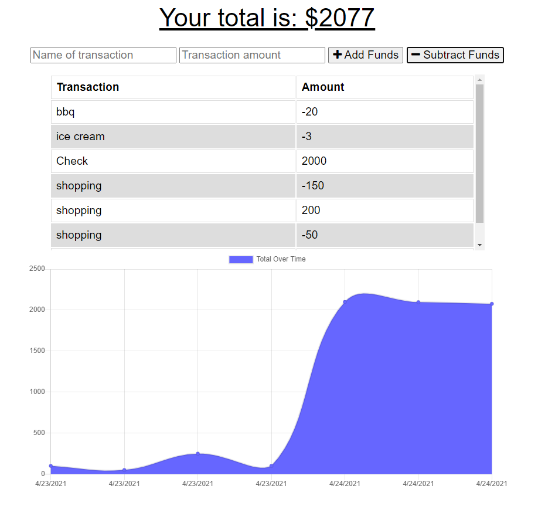

# Budget_Tracker

# [ Description. ](#desc)
The user will able to add expenses and deposits to their budget with or without a connection. 

# Table Of Contents
<a name="desc">Description</a>

# Screenshot

# Deployment
https://github.com/swoo328/Budget_Tracker
https://bugdettrackkk.herokuapp.com/
